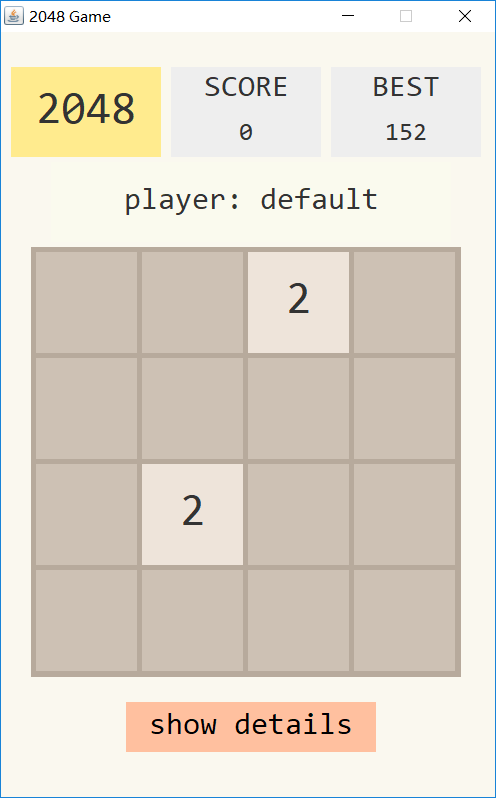
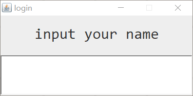
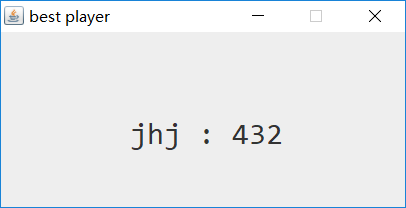
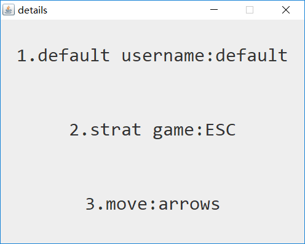
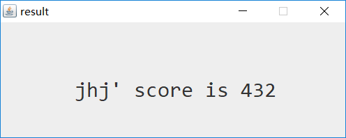
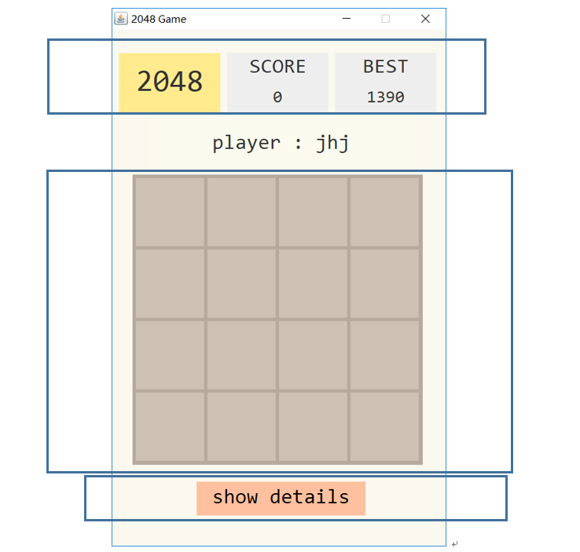

# 2048 小游戏

[TOC]

---

## 1. 主要实现

+ 文件读写，最高分的纪录
+ 一些监听器的装饰

## 2. 2048基本功能

+ 键盘读入上下左右移动（`KeyListener`）

+ 输入指令如果不能使方块有移动的话，输入指令无效

+ 每动一个回合会产生一个新方块
    + 产生方块上数字的概率为 `'2' : '4' : '8' = 7:2:1`

+ 分数按照以下规则计算
    + 初始分数为 `0`
    + 加上合并之前的方块上的数字
        + 例如 `2` 和 `2` 合并生成 `4` 则加 `2` 分
    + 方块上面的数字大于等于 `2048` 则无法合并

## 3. 其他

+ 开始的时候有一个欢迎界面,用于输入用户名（默认 `default`）
    + 输入用户名后可以显示在游戏界面上（`ActionListener`）

+ `ESC` 开始游戏（`KeyListener`）或者重新开始游戏
+ 鼠标移动到 `BEST` 上面的时候可以显示最高分的纪录（`MouseListener`）

+ 鼠标移动到的 `detail` 的上面时会显示游戏规则

+ 游戏结束后，会跳出一个 `JFrame` 用来显示分数

+ 实现了最高分的记录,在退出程序后重新加载也可以得到最高分
    + 成绩被记录在 `data.2048` 文件中（文件读写）

## 4. 内部说明

+ 整体一个 `GameJFrame` 类（继承自`JFrame`）

+ 自上而下有 `3` 个类 `Nav, Body, Detail`
+ `Body` 的布局为 `GridLayout(4,4)`
+ 跳出的窗口全都是通过 `JFrame` 或者是通过继承自 `JFrame` 的子类实现