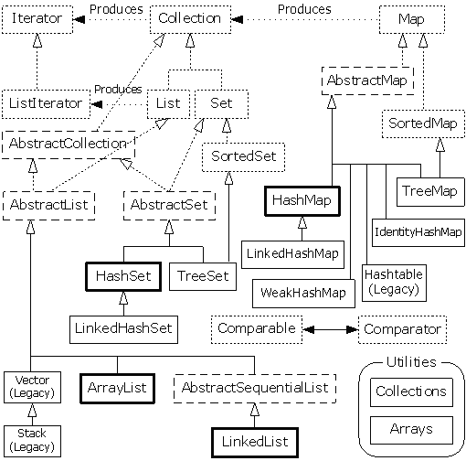

# Chapter_17 容器深入研究

> [总目录](../README.md)

---

[TOC]

---
## 17.1 完整的容器分类法




## 17.2 填充容器

+ `Collections.fill()`
    + 类似于 `Arrays`
+ `Collections.nCopies()`
    + 复制相同的元素

```java
import java.util.Collections;
import java.util.List;
import java.util.ArrayList;

public class TestCollections {
    public static void main(String...args) {
        List<TestCollections> list =
            new ArrayList<TestCollections>(
                Collections.nCopies(2, new TestCollections())
            );
        System.out.println(list);
        Collections.fill(list, new TestCollections());
        System.out.println(list);
    }
}
```

```output
[TestCollections@15db9742, TestCollections@15db9742]
[TestCollections@6d06d69c, TestCollections@6d06d69c]
```


### 17.2.1 一种 Generator 解决方案

+ `Generator` + `quality` 方案


### 17.2.2 Map生成器

+ 类似的 `Generator`
+ `next()` 生成一个 `Pair`
+ 通过两个 `Generator`

```java
class Pair<K,V>{
    public final K key;
    public final V value;
    public Pair(K key, V value) {
        this.key = key;
        this.value = value;
    }
}
```

+ 生成后可以利用 `Map.putAll()`，`Collections.addAll()` 添加


### 17.2.3 使用 Abstract 类

+ 通过创建定制的 `Collection` 和 `Map` 实现
+ 利用每个 `java.util` 容器都有自己的 `Abstract` 类，他们都提供了容器的部分实现
+ **享元**
    + 一种设计模式
    + 存储索引而不是实际的值
+ `AbstractMap`、`AbstractSet`、`AbstractList` ......
+ 示例代码 [Countries](Countries.java)


## 17.3 Collection 的功能方法

```java
public abstract boolean add(Object)
public abstract boolean remove(Object)
public abstract boolean equals(Object)
public abstract int hashCode()
public abstract void clear()
public abstract boolean contains(Object)
public abstract boolean isEmpty()
public abstract Iterator iterator()
public abstract int size()
public abstract Object[] toArray(Object[])
public abstract Object[] toArray()
public default Spliterator spliterator()
public abstract boolean addAll(Collection)
public default Stream stream()
public abstract boolean containsAll(Collection)
public abstract boolean removeAll(Collection)
public default boolean removeIf(Predicate)
public abstract boolean retainAll(Collection)
public default Stream parallelStream()
public default void forEach(Consumer)
```


## 17.4 可选操作

+ 执行各种不同的添加和移除方法在 `Collection` 接口中都是可选操作
+ 也就是说实现类不需要为这些方法提供功能定义
+ 似乎与接口原则冲突
+ 只有在特里中才会有未获支持的操作
+ `UnSupportedOperationException`
+ 只有在运行时才能检测到（动态检查）


### 17.4.1 未获支持的操作

+ 在 `Abstract` 类中实现为简单的 `throw new UnsupportedOperationException();`

```java
// java.util.AbstractList.java
public E set(int index, E element) {
    throw new UnsupportedOperationException();
}
```


+ 最常见的未获支持的操作，都来自于背后由固定尺寸的数据结构支持的操作

+ 例如使用 `Arrays.asList()` 得到的  `List`
+ 使用 `Collection` 中不可修改的方法创建

+ [Unsupported](Unsupported.java)

```java
List<String> list =
    Arrays.asList("A B C D E F G H I J K L".split(" "));
test("Modifiable Copy", new ArrayList<String>(list));
test("Arrays.asList()", list);
test("unmodifiableList()",
     Collections.unmodifiableList(
         new ArrayList<String>(list)));
```


## 17.5 List 的功能方法

```java
ArrayList<String> list = new ArrayList<>();
// list.add(1, "x");
// IndexOutOfBoundsException: Index: 1, Size: 0
System.out.println(list);
```

+ 单向链表：[SList](SList.java)


## 17.6 Set 和存储顺序

| 类别 | 作用 |
| :--: | :--: |
| Set(interface)     | 不保证顺序，唯一性（`equals()`） |
| HashSet（**快**） | 需要定义 `HashCode()` |
| TreeSet | 底层为树结构，需要实现 `Comparable` 接口 |
| LinkedHashSet | `HashCode()` + 维护插入顺序 |

+ 通常会将 `compareTo()` 和 `equals()` 的返回值设为一致
    + `compareTo()` 为 `0`，`equals()` 为 `true`
    + `compareTo()` 为 `非0`，`equals()` 为 `false`
+ `TreeSet` 的对象没有实现 `Comparable` 接口时，抛出异常
+ `HashSet` 的对象没有实现 `hashcode()` 方法时，采用默认的方法


### 17.6.1 SortedSet

```java
public default Spliterator spliterator()
public abstract Object first()
public abstract Comparator comparator()
public abstract Object last()

// 左头右尾,左开右闭
public abstract SortedSet headSet(Object) // 大于
public abstract SortedSet subSet(Object,Object) // 取大小在二者之间的元素
public abstract SortedSet tailSet(Object) // 小于
```


## 17.7 队列

+ `LinkedList/PriorityList`
    + 区别在排序行为而不是性能


### 17.7.1 优先级队列

+ `Comparable` 接口


### 17.7.2 双向队列

+ 代理 `LinkedList`


## 17.8 理解 Map

+ `key-value`
    + 键值对
    + 关联数组


### 17.8.1 性能

+ `HashMap`：散列码

|      Map实现      |                特性                |
| :---------------: | :--------------------------------: |
|   HashMap（快）   |  散列表（可以设置容量、负载因子）  |
|   LinkedHashMap   |       插入次序/最近最少使用        |
|      TreeMap      |  红黑树，`Comparable/Comparator`   |
|    WeakHashMap    |   弱键映射，允许释放键指向的对象   |
| ConcurrentHashMap |              线程安全              |
|  IdentityHashMap  | 使用 `==` 代替 `equals` 的 HashMap |


### 17.8.2 SortedMap

+ `TreeMap` 实现了 `SortedMap`
+ 确保键处于排序状态

```java
public abstract Collection values()
public abstract Set entrySet()
public abstract Set keySet()
public abstract Comparator comparator()
public abstract Object firstKey()
public abstract SortedMap headMap(Object)
public abstract Object lastKey()
public abstract SortedMap subMap(Object,Object)
public abstract SortedMap tailMap(Object)
public abstract Object remove(Object)
public default boolean remove(Object,Object)
public abstract Object get(Object)
public abstract Object put(Object,Object)
public abstract boolean equals(Object)
public abstract int hashCode()
public abstract void clear()
public abstract boolean isEmpty()
public default Object replace(Object,Object)
public default boolean replace(Object,Object,Object)
public default void replaceAll(BiFunction)
public abstract int size()
public abstract void putAll(Map)
public default Object putIfAbsent(Object,Object)
public default void forEach(BiConsumer)
public default Object compute(Object,BiFunction)
public default Object computeIfAbsent(Object,Function)
public default Object computeIfPresent(Object,BiFunction)
public abstract boolean containsKey(Object)
public abstract boolean containsValue(Object)
public default Object getOrDefault(Object,Object)
public default Object merge(Object,Object,BiFunction)
```


### 17.8.3 LinkedHashMap

```java
/**
* The iteration ordering method for this linked hash map:
* true for access-order, false for insertion-order.
*/
final boolean accessOrder;
```

```java
~~~~~static method~~~~~

~~~~~non-static method~~~~~
public Object get(Object)
public Collection values()
public void clear()
public void replaceAll(BiFunction)
public Set entrySet()
public void forEach(BiConsumer)
public Set keySet()
public boolean containsValue(Object)
public Object getOrDefault(Object,Object)
public Object remove(Object)
public boolean remove(Object,Object)
public Object put(Object,Object)
public Object clone()
public boolean isEmpty()
public boolean replace(Object,Object,Object)
public Object replace(Object,Object)
public int size()
public void putAll(Map)
public Object putIfAbsent(Object,Object)
public Object compute(Object,BiFunction)
public Object computeIfAbsent(Object,Function)
public Object computeIfPresent(Object,BiFunction)
public boolean containsKey(Object)
public Object merge(Object,Object,BiFunction)
public boolean equals(Object)
public String toString()
public int hashCode()
public final void wait() throws InterruptedException
public final void wait(long,int) throws InterruptedException
public final native void wait(long) throws InterruptedException
public final native Class getClass()
public final native void notify()
public final native void notifyAll()

~~~~~constructor~~~~~
public LinkedHashMap()
public LinkedHashMap(int)
public LinkedHashMap(int,float)
public LinkedHashMap(Map)
public LinkedHashMap(int,float,boolean)
```


## 17.9 散列与散列码

+ `HashMap` 利用 `equals()` 判断键值是否相同
+ 在覆盖 `hashCode()` 方法的同时应该同时覆盖 `equals()` 方法
+ 正确的 `equals()` 方法
    + 自反性：`x.equals(x) = true`
    + 对称性：`x.equals(y) = true` `<=>` `y.equals(x) = true`
    + 传递性：`x.equals(y) = true && y.equals(z) = true` `=>` `x.equals(z) = true`
    + 一致性：多次调用返回值一致
    + `x.equals(null) = false`

```java
// instanceof
Object o1 = new Object();
Object o2 = null;
System.out.println(o1 instanceof Object); // true
System.out.println(o2 instanceof Object); // false
```


### 17.9.1 理解 hashCode()

### 17.9.2 为速度而散列

+ 散列使得查询得以快速进行
+ 另外一种方法：保持有序状态，二分
+ 散列函数，冲突（外部链接）
+ 为了分布均匀
    + 通常选择质数作为桶的数目
    + 每个桶为一个 `LinkedList`


### 17.9.3. 覆盖 hashCode()

+ `hashCode()` 每次调用都应该生成相同的值
    + 不应依赖于对象中易变的数据
    + 不能依赖于具有唯一性的值（例如地址）
        + 若为地址，以下则不相同
        + `new MyObject(1).hashCode() = new Object(1).hashCode()`
+ `hashCode()` 不必时独一无二的，但是配合上 `equals()` 应该能唯一确定


#### hashCode 设计指导

+ 给 `int` 变量 `result` 赋值非零常数
+ 为每一个有意义的域（可以用于`equals()` 操作）计算出一个 `int` 散列码 `c`

|       域类型        |                计算                 |
| :-----------------: | :---------------------------------: |
|       boolean       |           c = (f ? 0 : 1)           |
| byte/char/short/int |             c = (int)f              |
|        long         |      c = (int)(f ^ (f >>> 32))      |
|        float        |     c = Float.floatToIntBits(f)     |
|       double        | long l = Double.doubleToLongBits(f) |
|                     |      c = (int)(l ^ (l >>> 32))      |
|       Object        |            f.hashCode()             |
|        数组         |         每个元素做如上操作          |

+ 合并计算得到的散列码：`result = result*37 + c`
+ 返回 `result`
+ 检查相同对象是否具有相同散列码


## 17.10 选择接口的不同实现

+ 只有 `4`  种容器：`Map/Set/List/Queue`
+ `HashTable/Vector/Stack`
    + 遗留类型，避免使用
+ 具体使用时候需要了解底层的实现


### 17.10.1 性能测试框架

+ **模板方法设计模式**

```java
// 示例代码
public abstract class Test<C> {
    String name;
    public Test(String name) { this.name = name; }
    abstract int test(C container, TestParam tp);
}
```


### 17.10.2 对 List 的选择

+ 示例代码 `ListPerformance.java`


### 17.10.3 微基准测试的危险

+ 开源的 **剖析器**


### 17.10.4 对 Set 的选择

+ 示例代码 `SetPerformance.java`


### 17.10.5 对 Map 的选择

+ 示例代码 `MapPerformance.java`


#### 17.10.5.1 HashMap 的性能因子

+ **容量**、**初始容量**、**尺寸**、**负载因子**（超过时则进行 **再散列**，默认 `0.75`）


## 17.11 实用方法

+ `java.util.Collections`

```java
Collections.checkedList(List<T>, Class<T>);
checkedMap
checkedSet
checkedCollections
checkedSortedMap
checkedSortedSet
```

```java
max(Collection)
min
max(Collection, Comparator)
min
```

```java
indexOfSubList(List source, List target)
lastIndexOfSubList()
```

```java
replaceAll(List<T>, T oldValue, T newValue)
```

```java
reverse(List)
```

```java
// 返回一个 Comparator,逆转
reverseOrder()
reverseOrder(Comparator<T>)
```

```java
// 所有元素向后移动 distance 个位置(环)
rotate(List, int distance)
```

```java
shuffle(List)
shuffle(List, Random)
```

```java
sort(List<T>)
sort(List<T>, Comparator<? super T> c)
```

```java
copy(List<? super T> dest, List<? extends T> src)
```

```java
swap(List, int i, int j) // 通常比自己的代码块(优化?)
```

```java
fill(List<? super T>, T x)
```

```java
nCopies(int n, T x) // 不可改变
```

```java
disjoint(Collection, Collection) // 当两个集合没有任何相同元素时,返回 true
```

```java
frequency(Collection, Object x) // 返回个数
```

```java
emptyList() // 返回不可变的空 List,泛型
emptySet()
emptyMap()
```

```java
singleton(T x) // 单一对象,不可变
singletonList()
singletonMap()
```

```java
// 产生一个 ArrayList<T>,用于转换旧代码
list(Enumeration <T> e)
// 转换为旧代码
enumeration(Collection<T>)
```


### 17.11.1 List 的排序和查询

+ `binarySearch` 之前需要 `sort`


### 17.11.2 不可变 Map, Collection

```java
Collections.unmodifiableCollection(
    new ArrayList<String>(data)
);
```

+ 对于改变的行为，可以编译，运行时会抛出异常 `UnsupportedOperationException`
+ 在初始化的时候就要填入有意义的数据
+ 一种设计方法
    + 将这个 `Collection ` 的原始引用保存为 `private` 变量
    + 包装成 `UnmodifiableCollection` 传递给客户端


### 17.11.3 Collection 或 Map 的同步控制

+ `synchronized`

```java
 Collections.synchronizedCollection(
     new ArrayList<String>()
 );
```


#### 17.11.3.1 快速报错

+ `fail-fast`
    + 一旦发现其他进程修改当前迭代器访问容器时抛出异常
    + `concurrentModificationException`
+ 机制如下：创建迭代器后不允许修改元素

```java
// 示例代码
import java.util.*;

public class FailFast {
    public static void main(String[] args) {
        Collection<String> c = new ArrayList<String>();
        Iterator<String> it = c.iterator();
        c.add("An object");
        try {
            String s = it.next();
        } catch(ConcurrentModificationException e) {
            System.out.println(e);
        }
    }
}
/* Output:
java.util.ConcurrentModificationException
*/
```

+ 以下容器都使用了能够避免抛出异常的技术
    + `ConcurrentHashMap`、`CopyOnWriteArrayList `、`CopyOnWriteArraySet`


## 17.12 持有引用

+ `java.lang.ref` 类库包含了一组类，为垃圾回收提供了更大的灵活性
+ 当存在可能耗尽内存的大对象时，这些类特别有用
+ 有 `3` 个继承自 抽象类 `Reference`  的子类
    + `SoftReference`、`WeakReference`、`PhantomReference`
    + 强到弱排列，对应不同级别的可获得性
+ 当垃圾回收器正在考察的对象**只能**通过某个 `Reference` 对象获得时
+ 上述这些不同的派生类提供了不同级别的间接性提示
+ 所以不能有普通的引用指向这个上述对象
+ `ReferenceQueue`
    + `Soft/Weak` 可以选择是否放入 `ReferenceQueue`
    + `Phantom` 只能放入 `ReferenceQueue`
+ 区别
    + `Soft`：只要内存空间足够，垃圾回收器就不会回收它
    + `Weak`： 当 `JVM` 进行垃圾回收时，无论内存是否充足，都会回收被弱引用关联的对象
    + `Phantom`： 不影响对象的生命周期

```java
// 示例代码
import java.lang.ref.*;
import java.util.*;

class VeryBig {
    private static final int SIZE = 10000;
    private long[] la = new long[SIZE];
    private String ident;
    public VeryBig(String id) { ident = id; }
    public String toString() { return ident; }
    protected void finalize() {
        System.out.println("Finalizing " + ident);
    }
}

public class References {
    private static ReferenceQueue<VeryBig> rq =
        new ReferenceQueue<VeryBig>();
    public static void checkQueue() {
        Reference<? extends VeryBig> inq = rq.poll();
        if(inq != null)
            System.out.println("In queue: " + inq.get());
    }
    public static void main(String[] args) {
        int size = 10;
        // Or, choose size via the command line:
        if(args.length > 0)
            size = new Integer(args[0]);
        LinkedList<SoftReference<VeryBig>> sa =
            new LinkedList<SoftReference<VeryBig>>();
        for(int i = 0; i < size; i++) {
            sa.add(new SoftReference<VeryBig>(
                new VeryBig("Soft " + i), rq));
            System.out.println("Just created: " + sa.getLast());
            checkQueue();
        }
        LinkedList<WeakReference<VeryBig>> wa =
            new LinkedList<WeakReference<VeryBig>>();
        for(int i = 0; i < size; i++) {
            wa.add(new WeakReference<VeryBig>(
                new VeryBig("Weak " + i), rq));
            System.out.println("Just created: " + wa.getLast());
            checkQueue();
        }
        SoftReference<VeryBig> s =
            new SoftReference<VeryBig>(new VeryBig("Soft"));
        WeakReference<VeryBig> w =
            new WeakReference<VeryBig>(new VeryBig("Weak"));
        System.gc();
        LinkedList<PhantomReference<VeryBig>> pa =
            new LinkedList<PhantomReference<VeryBig>>();
        for(int i = 0; i < size; i++) {
            pa.add(new PhantomReference<VeryBig>(
                new VeryBig("Phantom " + i), rq));
            System.out.println("Just created: " + pa.getLast());
            checkQueue();
        }
    }
}
```


### 17.12. WeakHashMap

+ `WeakReference`


## 17.13 Java 1.0/1.1 容器

### 17.13.1 Vector，Enumeration

+ `ArrayList`，`Iterator`

### 17.13.2 HashTable

+ `HashMap`

### 17.13.3 Stack

+ `LinkedList`

### 17.13.4 BitSet

+ 空间小，访问稍慢
+ 最小单位是 `long`
+ `EnumSet`


