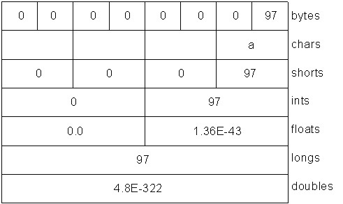
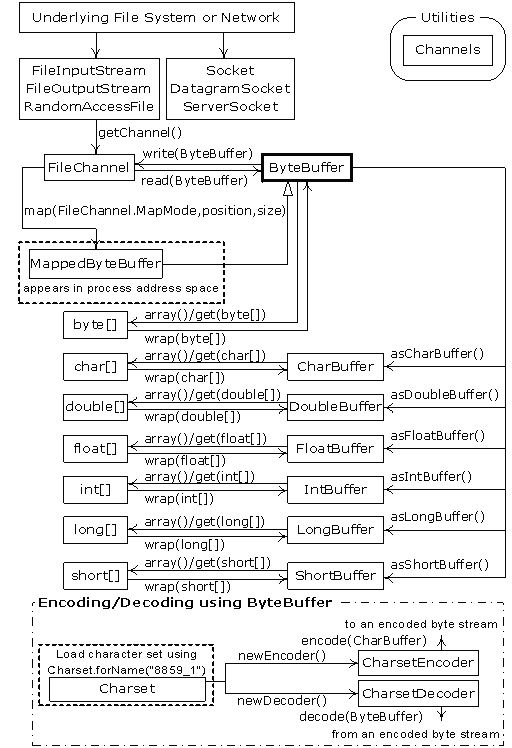

# Chapter_18 Java I/O系统 [part1]

> [总目录](../README.md)

---

[TOC]

---

[part2](README_part2.md)


## 18.1 File 类

### 18.1.1 目录列表器

+ `list()` 方法
+ `FilenameFilter` 接口
    + `visit-accept`：回调，一种策略设计模式

```java
package java.io;
public interface FilenameFilter {
    boolean accept(File dir, String name);
}
```

+ [DirList](DirList.java)

```java
import java.util.Arrays;
import java.io.File;
import java.io.FilenameFilter;
import java.util.regex.Pattern;
import java.util.regex.Matcher;

public class DirList {
    // 匿名类
    // 不加 final 在实际上也是 final 的(也OK)
    private static FilenameFilter MyFilter(final String format)  {
        return new FilenameFilter() {
            private Pattern regex = Pattern.compile(format);
            @Override
            public boolean accept(File dir, String name) {
                return regex.matcher(name).matches();
            }
        };
    }

    public static void main(String...args) {
        // 传入当前作为基目录
        File path = new File(".");
        // 所有文件
        System.out.println("All Files:");
        String[] list = path.list();
        print(list);

        // FilenameFilter
        String needed = ".*\\.java";
        System.out.println(needed + ":");
        list = path.list(MyFilter(needed));
        print(list);
    }

    public static void print(String[] list) {
        Arrays.sort(list, String.CASE_INSENSITIVE_ORDER);
        for(String dirItem : list) {
            System.out.println("    " + dirItem);
        }
    }
}
```

+ 一些实用方法：[TestFile](TestFile.java)


## 18.1.2 目录实用工具

+ 文件树
+ [Directory](Directory.java)
+ 策略设计模式

```java
public interface Strategy {
    void process(File file);
}
```


### 18.1.3 目录的创建及检查

```java
public boolean delete() // 只能删除空文件夹
public boolean exists()
public boolean mkdir()
public boolean mkdirs() // 多层目录
public boolean renameTo(File dest)
```


## 18.2 输入和输出

+ **流**
    + 代表任何有能力产出数据的数据源对象，或者是有能力接收数据的接收端对象
+ `InputStream/Reader`
    + `read()`：读取字节或者字节数组（`byte`）
+ `OutputStream/Writer`
    + `write()`：写字节或者字节数组（`byte`）
+ `Java1.0` 中规定所有的 **输入**/**输出** 类都必须继承自 `InputStream/OuputStream`


### 18.2.1 InputStream 类型

+ `InputStream` 的作用时用来表示那些从不同数据源产生输入的类
    + 字节数组
    + `String` 对象
    + 文件
    + 管道
    + 一个由其他种类的流组成的序列
    + 其他数据源（`Internet` 连接）
+ 每一种数据源都有相应的 `InputStream` 子类
    + `ByteArrayInputStream`
    + `StringBufferInputStream`
    + `FileInputStream`
    + `PipedInputStream`
    + `SequenceInputStream`
    + `FilterInputStream`


### 18.2.2 OuputStream 类型

+ `ByteArrayOutputStream`
+ `FileOutputStream`
+ `PipedOutputStream`
+ `FilterOutputStream`


## 18.3 添加属性和有用的接口

+ **装饰器模式**
+ `filter` 类时所有装饰器类的基类
+ `FilterInputStream` 是用来提供装饰器类皆苦以控制特定输入流的类
+ `FilterOutputStream`


### 18.3.1 通过 FilterInputStream 从InputStream 中读取数据

+ `FilterInputStream ` 类型

    + `DataInputStream`
    + `BufferedInputStream`
    + `LineNumberInputStream`
    + `PushbackInputStream`

+ 功能

    + `DataInputStream`
        + 允许我们读取不同基本数据类型以及 `String` 对象
        + `readByte()/readFloat()/...`
        + 搭配 `DataOutputStream` 实现数据的迁移

    + 其他 `3` 类则在内部修改 `InputStream` 的行为方式
        + `BufferedInputStream`
            + 是否缓冲
                + 一般都会对输入进行缓冲
                + 因此将无缓冲输入作为特殊情况（仅作为一种方法调用）
        + `LineNumberInputStream`
            + 是否保留读过的行（允许设置和查询行数）
        + `PushbackInputStream`
            + 是否允许将单一字符退回到流中


### 18.3.2 通过 FilterOutputStream 从OutputStream 中读取数据

+ `FilterOutputStream ` 类型
    + `DataOutputStream`
        + `writeByte()/...`
    + `PrintOutputStream`
        + `println()/print()`
        + 未完全国际化
        + 捕获了所有异常，因此需要手动 `checkError()` 找异常
    + `BufferedOutputStream`
        + 缓冲


## 18.4 Reader 和 Writter

+ `Java 1.1` 的重大修改，为了国际化，`Unicode`
+ `Reader/Writer` 提供兼容 `Unicode` 与面向**字符**的 `I/O` 功能
+ 适配器类
    + `InputStreamReader` 可以将 `InputStream` 转化为 `Reader`
    + `OutputStreamReader`


### 18.4.1数据的来源和去处

|       来源与去处：Java 1.0 类       |       相应的 Java 1.1 类       |
| :---------------------------------: | :----------------------------: |
|           **InputStream**           |           **Reader**           |
|                                     | **适配器：InputStreamReader**  |
|          **OutputStream**           |           **Writer**           |
|                                     | **适配器：OutputStreamWriter** |
|         **FileInputStream**         |         **FileReader**         |
|        **FileOutputStream**         |         **FileWriter**         |
| **StringBufferInputStream（弃用）** |        **StringReader**        |
|         **（无对应的类 ）**         |        **StringWriter**        |
|      **ByteArrayInputStream**       |      **CharArrayReader**       |
|      **ByteArrayOutputStream**      |      **CharArrayWriter**       |
|        **PipedInputStream**         |        **PipedReader**         |
|        **PipedOutputStream**        |        **PipedWriter**         |

+ 继承结构大体相似


### 18.4.2 更改流的行为

+ 与 `InputStream` 等类似，但不完全一样
+ 类的组织形式不太相同，但是接口类似
+ 下图中的近似关系更加粗略一些

|    过滤器：Java 1.0 类    |               相应的 Java 1.1 类                |
| :-----------------------: | :---------------------------------------------: |
|   **FilterInputStream**   |                **FilterReader**                 |
|  **FilterOutputStream**   |      **FilterWriter（抽象类，没有子类）**       |
|  **BufferedInputStream**  |               **BufferedReader**                |
| **BufferedOutputStream**  |               **BufferedWriter**                |
|    **FileInputStream**    |        **FileReader（也有 readLine()）**        |
|   **FileOutputStream**    |                 **FileWriter**                  |
|    **DataInputStream**    |               **DataInputStream**               |
|      **PrintStream**      |                 **PrintWriter**                 |
| **LineNumberInputStream** |              **LineNumberReader**               |
|    **StreamTokenizer**    | **StreamTokenizer（接受使用 Reader 的构造器）** |
|  **PushbackInputStream**  |               **PushbackReader**                |

+ 注意当我们使用 `readLine()` 时，不应该使用 `DataInputStream`，而是 `BufferedReader`
    + 除了这一点，`DataInputStream` 仍然是 `I/O` 的首选
+ 方便过渡，`PrintWriter` 提供了一个能接受 `Writer` 对象和 `OutputStream` 对象的构造器


### 18.4.3 未发生变化的类

+ `DataOuputStream/File/RandmAccessFile/SequenceInputStream`


## 18.5 自我独立的类 RandomAccessFile

+ 适用于有大小已知的记录组成的文件
+ 可以通过 `seek()` 修改指针
+ 不是 `InputStream` 继承结构中的一部分

```java
// 继承结构
java.lang.Object
    --java.io.RandomAccessFile

// 实现接口
    Closeable, DataInput, DataOutput, AutoCloseable
```

+ `getFilePointer()`，`seek()`，`length()`
+ `r`，`rw`（不支持只写文件）
+ 大部分功能已经被 `JDK 1.4` 中的 `nio` 取代


## 18.6 I/O 流的典型使用方式

+ [InputSample](InputSample.java)

### 18.6.1 缓冲输入文件

```java
BufferedReader in = new BufferedReader(new FileReader("Sample.txt"));
```

```java
public static void bufferedInputFile ()
    throws Exception {
    BufferedReader in = new BufferedReader(
        new FileReader("Sample.txt")
    );
    String s;
    StringBuilder sb = new StringBuilder();
    while((s = in.readLine()) != null){
        sb.append(s);
        sb.append("\n");
    }
    System.out.println(sb);
}
```


### 18.6.2 从内存输入

```java
StringReader in = new StringReader(
    // return a String(上述函数)
    bufferedInputFile(fileName)
);
```


### 18.6.3 格式化的内存输入

+ `DataInputStream`：面向字节（`byte`）
+ 输入结束抛出异常 `EOFException`
    + 不提倡使用异常进行流控制

```java
public static void formattedMemoryInput(String fileName)
    throws Exception {
    try {
        DataInputStream in = new DataInputStream(
            new ByteArrayInputStream(
                bufferedInputFile(fileName).getBytes()
            )
        );
        while(true) {
            // 中文会出问题 unicode
            System.out.print((char)in.readByte());
        }
    } catch (EOFException e) {
        System.err.println("End Of Stream!");
    }
}
```

```java
public static void formattedMemoryInput2(String fileName)
    throws Exception {
    DataInputStream in = new DataInputStream(
        new BufferedInputStream(
            new FileInputStream(fileName)
        ));
    while(in.available() != 0) {
        System.out.print((char)in.readByte());
    }
}
```


### 18.6.4 基本的文件输出

+ 注意我们自己可以很方便的记录行号（使用一个 `int`）
    + 不需要使用 `LineNumberInputStream`

```java
PrintWriter out = new PrintWrier(
    new BufferedWriter(
        new FileWriter(outputFileName)
    ));
```

```java
public static void basicFileOutput(
    String inputFileName, String outputFileName)
    throws Exception {
    BufferedReader in = new BufferedReader(
        new FileReader(inputFileName)
    );
    PrintWriter out = new PrintWriter(
        new BufferedWriter(
            new FileWriter(outputFileName)
        ));
    String line;
    while((line = in.readLine()) != null){
        out.println(line);
    }
    out.close();
    in.close();
}
```

+ 输出结束需要显式调用 `close()`
    + 否则可能因为没有及时关闭而导致有些内容还在缓冲区没有没刷出


#### 18.6.4.1 文件文本输出的快捷方式

```java
// java.io.PrintWriter
public PrintWriter(String fileName) throws FileNotFoundException {
    this(
        new BufferedWriter(
            new OutputStreamWriter(
                new FileOutputStream(fileName)
    )), false);
}
```


### 18.6.5 存储和恢复数据

+ [StoreAndRecover.java](StoreAndRecover.java)

```java
DataOutputStream out = new DataOutputStream(
    new BufferedOutputStream(
        new FileOutputStream("Data.txt")));
// ...
DataInputStream in = new DataInputStream(
    new BufferedInputStream(
        new FileInputStream("Data.txt")));
```

```java
// DataOutputStream
// ~~~~~static method~~~~~ //

// ~~~~~non-static method~~~~~ //
public final int size()
public synchronized void write(int) throws IOException
public synchronized void write(byte[],int,int) throws IOException
public void flush() throws IOException
public final void writeInt(int) throws IOException
public final void writeChar(int) throws IOException
public final void writeBytes(String) throws IOException
public final void writeUTF(String) throws IOException
public final void writeBoolean(boolean) throws IOException
public final void writeByte(int) throws IOException
public final void writeChars(String) throws IOException
public final void writeDouble(double) throws IOException
public final void writeFloat(float) throws IOException
public final void writeLong(long) throws IOException
public final void writeShort(int) throws IOException
public void write(byte[]) throws IOException
public void close() throws IOException
public final void wait() throws InterruptedException
public final void wait(long,int) throws InterruptedException
public final native void wait(long) throws InterruptedException
public boolean equals(Object)
public String toString()
public native int hashCode()
public final native Class getClass()
public final native void notify()
public final native void notifyAll()

// ~~~~~constructor~~~~~ //
public DataOutputStream(OutputStream)
```

+ 平台无关，`DataInputStream` 可以完全恢复 `DataOutputStream` 输出的数据


### 18.6.6 读写随机访问文件

+ `RandomAccessFile`
    + 相当于使用 `DataInputStream + DataOutputStream`
    + 实现了 `DataInput + DataOutput` 接口
+ [RandomAccessFileTest](RandomAccessFileTest.java)

```java
RandomAccessFile rf = new RandomAccessFile("rf.dat", "r");
long length = rf.length();
while(rf.getFilePointer() != length) {
    System.out.println(rf.readDouble());
}
// ...
rf.setLength(0);
```


### 18.6.7 管道流

+ 多线程


## 18.7 文件读写的实用工具

+ 把常用的文件流包装好，作为函数调用


### 18.7.1 读取二进制文件

```java
BufferedInputStream bf = new BufferedInputStream(
    new FileInputStream(file);
);
```


## 18.8 标准 I/O

### 18.8.1 从标准输入中读取

+ `System.in`：`InputStream`
+ `System.err/System.out`：`PrintStream`

```java
BufferedReader br = new BufferedReader(
    new InputStreamReader(System.in)
);
```


### 18.8.2 将 System.out 转化为 PrintWriter

```java
PrintWriter out = new PrintWriter(System.out, true);
// autoFlush : true
```


### 18.8.3 标准 I/O 重定向

+ **字节流**

```java
System.setIn(InputStream)
System.setOut(PrintStream)
System.setErr(PrintStream)
```


## 18.9 进程控制

+ [OSExecute](OSExecute.java)
+ 此处的 `OSExecuteException` 是想要将这里抛出的异常区别于其他异常

```java
public class TestOSExecute {
    public static void main(String...args) {
        if(args.length == 0) {
            System.err.println("Lack of command line!");
            System.exit(1);
        }
        OSExecute.command(args);
    }
}
```


## 18.10 新 I/O

+ `JDK 1.4` 引入了 `java.nio.*`
    + 实际上 `java.io.*` 也已经重新使用 `java.nio.*` 重新实现过了
+ 提高速度
    + 使用的结构更近于操作系统使用 `I/O` 的方式：**通道和缓冲器**
    + 我们只和缓冲器打交道，缓冲器和通道打交道
    + 唯一直接与通道交互的缓冲器为 `ByteBuffer`（**字节**）
+ `FileInputStream/FileOutputStream/RandomAccessFile` 被修改，以便产生 `FileChannel`
+ `java.nio.channels.Channel` 中可以在通道中产生 `Reader/Writer`
+ [GetChannel](GetChannel.java)
    + `FileChannel`，`ByteBuffer`

```java
public static void main(String[] args) throws Exception {
    // Write a file:
    FileChannel fc =
        new FileOutputStream("data.txt").getChannel();
    fc.write(ByteBuffer.wrap("Some text ".getBytes()));
    fc.close();
    // Add to the end of the file:
    fc =
        new RandomAccessFile("data.txt", "rw").getChannel();
    fc.position(fc.size()); // Move to the end
    fc.write(ByteBuffer.wrap("Some more".getBytes()));
    fc.close();
    // Read the file:
    fc = new FileInputStream("data.txt").getChannel();
    ByteBuffer buff = ByteBuffer.allocate(BSIZE);
    fc.read(buff);
    buff.flip();
    while(buff.hasRemaining())
        System.out.print((char)buff.get());
}
```

+ 感觉 `FileChannel` 更像是 `C` 里面的功能（**ics**）
+ 一旦调用 `read()` 来告知 `FileChannel` 向 `ByteBuffer` 存储字节，就必须调用缓冲器上的 `flip()`
+ 如果我们打算使用缓冲器执行进一步的 `read()` 操作，我们也必须得调用 `clear()` 来为每个 `read()` 做准备

```java
public static void copy1(String src, String dst) throws Exception {
    FileChannel
        in = new FileInputStream(src).getChannel(),
        out = new FileOutputStream(dst).getChannel();
    ByteBuffer buffer = ByteBuffer.allocate(BSIZE);
    while(in.read(buffer) != -1) {
        buffer.flip(); // Prepare for writing
        out.write(buffer);
        buffer.clear();    // Prepare for reading
    }
}
```

+ `transferTo + transferFrom` 可以直接连接两个通道

```java
public static void copy2 (String src, String dst) throws Exception {
    FileChannel
        in = new FileInputStream(src).getChannel(),
        out = new FileOutputStream(dst).getChannel();
    in.transferTo(0, in.size(), out);
    // out.transferFrom(in, 0, in.size());
}
```


### 18.10.1 转换数据

+ `CharBuffer`
+ 需要注意编码格式
    + 比较好的方式在写入文件时指定编码为 `UTF-16BE`（`Java` 默认编码）
+ [BufferToText](BufferToText.java)
    + **这一部分代码还是建议看一看**


### 18.10.2 获取基本类型

```java
int pos1 = bb.position();
bb.asShortBuffer().put((short)1142);
bb.position(90);
bb.asShortBuffer().put((short)0000);
print(bb.getShort());
bb.position(pos1);
print(bb.getShort());
/* Output
0
1142
*/
```

```java
// Store and read a short:
bb.asShortBuffer().put((short)471142); // 注意只有 short 需要进行强制类型转换
// ...
// Store and read an int:
bb.asIntBuffer().put(99471142);
// ...
// Store and read a long:
bb.asLongBuffer().put(99471142);
// ...
// Store and read a float:
bb.asFloatBuffer().put(99471142);
// ...
// Store and read a double:
bb.asDoubleBuffer().put(99471142);
```


### 18.10.3 视图缓冲器

+ 修改了视图之后，直接反映到底层数组上

+ `IntBuffer`

```JAVA
import java.nio.*;
public class IntBufferDemo {
    private static final int BSIZE = 1024;
    private static void printPos(IntBuffer ib, ByteBuffer bb) {
        System.out.println(
            "pos(ib): "+ib.position()
            + ", pos(bb) : " + bb.position());
    }
    public static void main(String[] args) {
        ByteBuffer bb = ByteBuffer.allocate(BSIZE);
        IntBuffer ib = bb.asIntBuffer();
        printPos(ib, bb); // print position
        // Store an array of int:
        ib.put(new int[]{ 11, 42, 47, 99, 143, 811, 1016 });
        printPos(ib, bb); // print position
        // Absolute location read and write:
        System.out.println(ib.get(3));
        printPos(ib, bb); // print position
        ib.put(3, 1811);
        printPos(ib, bb); // print position
        // Setting a new limit before rewinding the buffer.
        ib.flip();
        printPos(ib, bb); // print position
        while(ib.hasRemaining()) {
            int i = ib.get();
            System.out.println(i);
        }
    }
}
```

```output
pos(ib): 0, pos(bb) : 0
pos(ib): 7, pos(bb) : 0
99
pos(ib): 7, pos(bb) : 0
pos(ib): 7, pos(bb) : 0
pos(ib): 0, pos(bb) : 0
11
42
47
1811
143
811
1016
```

+ `put` 会修改当前视图的 `position`，但不会修改关联的其他视图
    + 原因是这里的 `position/index` 本质上是当前视图所示类别的基础上的 `position`
    + 使用 `CharBuffer` 便能够清楚地看到
+ **视图**（`Big-Endian`）




#### 18.10.3.1 字节存放顺序

+ `ByteBuffer` 默认`Big-Endian` ，可以通过调用  `order()` 方法设置
    + `ByteBuffer.BIG_ENDIAN`，`ByteBuffer.LITTLE_ENDIAN`
+ `0000 0000 0110 0001`
    + 大端法（`BE`）：`97
        `
    + 小端法（`LE`）：`24832`
+ 网络传输常用大端法

```java
// 示例代码
import java.nio.*;
import java.util.*;
import static net.mindview.util.Print.*;

public class Endians {
    public static void main(String[] args) {
        ByteBuffer bb = ByteBuffer.wrap(new byte[12]);
        bb.asCharBuffer().put("abcdef");
        print(Arrays.toString(bb.array())); // 默认大端
        // array() 方法时可选的,我们只能对由数组支持的缓冲器调用该方法
        // 否则会抛出异常 UnsupportedOperationException
        bb.rewind();
        bb.order(ByteOrder.BIG_ENDIAN); // 设置为大端
        bb.asCharBuffer().put("abcdef");
        print(Arrays.toString(bb.array()));
        bb.rewind();
        bb.order(ByteOrder.LITTLE_ENDIAN); // 设置为小端
        bb.asCharBuffer().put("abcdef");
        print(Arrays.toString(bb.array()));
    }
}
/* Output:
[0, 97, 0, 98, 0, 99, 0, 100, 0, 101, 0, 102]
[0, 97, 0, 98, 0, 99, 0, 100, 0, 101, 0, 102]
[97, 0, 98, 0, 99, 0, 100, 0, 101, 0, 102, 0]
*/
```


### 18.10.4 用缓冲器操纵数据

+ `nio` 类之间的关系，方便理解移动和转换数据



+ 我们不能将基本类型的缓冲器转化为 `ByteBuffer`
+ 但是可以通过创建一个 `ByteBuffer`，然后生成其关于基本类型的缓冲器的视图


### 18.10.5 缓冲器的细节

```java
// java.nio.Buffer
public final Buffer limit(int)
public final int limit()
public final Buffer clear()
public abstract Object array()
public abstract int arrayOffset()
public abstract boolean hasArray()
public abstract boolean isDirect()
public final Buffer position(int)
public final int position()
public final int remaining()
public final int capacity()
public final Buffer mark()
public final Buffer reset()
public final Buffer flip()
public final boolean hasRemaining()
public abstract boolean isReadOnly()
public final Buffer rewind()
public final void wait() throws InterruptedException
public final void wait(long,int) throws InterruptedException
public final native void wait(long) throws InterruptedException
public boolean equals(Object)
public String toString()
public native int hashCode()
public final native Class getClass()
public final native void notify()
public final native void notifyAll()
```


+ `Buffer` 由数据和可以高效访问及操纵这些数据的四个索引组成
    + `mark/position/limit/capacity`

```java
capacity()                  // 返回缓冲区 capacity
clear()                     // 清空缓冲区, position = 0, limit = capacity
flip()                      // limit = position, position = 0(准备从缓冲区读取数据)
limit()                     // 返回 limit
limit(int)                  // 设置 limit
mark()                      // mark = position
position(), position(int)   // 返回/设置 position
remaining()                 // 返回 limit - position
hasRemaining()              // 返回 position < limit;
rewind()                    // position = 0, mark = -1;
```

+ 一个示例应用

```java
// 示例代码(交换相邻两个字符)
// 调用之前需要设置 position = 0(rewind())
// BUG:如果长度为奇数,会抛出异常 BufferUnderflowException
private static void symmetricScramble(CharBuffer buffer){
    while(buffer.hasRemaining()) {
        buffer.mark();
        char c1 = buffer.get();
        char c2 = buffer.get(); // BufferUnderflowException
        buffer.reset();
        buffer.put(c2).put(c1);
    }
}
```


### 18.10.6 内存映射文件

+ 内存映射文件允许我们创建和修改那些因为太大而不能全部放入内存的文件
    + 因此我们可以假定将整个文件，甚至可以将其当作一个非常大的数组来访问
    + 实际上并没有整个放入内存，这由操作系统底层决定

```java
// public abstract class MappedByteBuffer extends ByteBuffer {}
MappedByteBuffer out =
    new RandomAccessFile("test.dat", "rw").getChannel()
    .map(FileChannel.MapMode.READ_WRITE, 0, length);
```


#### 18.10.6.1 性能

+ 尽管旧的 `io` 在使用 `nio` 重新实现后得到了性能提升，但是映射文件访问往往更加显著的加快速度
+ **测试设计模式**

```java
// 示例代码

import java.nio.*;
import java.nio.channels.*;
import java.io.*;

public class MappedIO {
    private static int numOfInts = 4000000;
    private static int numOfUbuffInts = 200000;
    private abstract static class Tester {
        private String name;
        public Tester(String name) { this.name = name; }
        public void runTest() {
            System.out.print(name + ": ");
            try {
                long start = System.nanoTime();
                test();
                double duration = System.nanoTime() - start;
                System.out.format("%.2f\n", duration/1.0e9);
            } catch(IOException e) {
                throw new RuntimeException(e);
            }
        }
        public abstract void test() throws IOException;
    }
    private static Tester[] tests = {
        new Tester("Stream Write") {
            public void test() throws IOException {
                DataOutputStream dos = new DataOutputStream(
                    new BufferedOutputStream(
                        new FileOutputStream(new File("temp.tmp"))));
                for(int i = 0; i < numOfInts; i++)
                    dos.writeInt(i);
                dos.close();
            }
        },
        new Tester("Mapped Write") {
            public void test() throws IOException {
                FileChannel fc =
                    new RandomAccessFile("temp.tmp", "rw")
                    .getChannel();
                IntBuffer ib = fc.map(
                    FileChannel.MapMode.READ_WRITE, 0, fc.size())
                    .asIntBuffer();
                for(int i = 0; i < numOfInts; i++)
                    ib.put(i);
                fc.close();
            }
        },
        new Tester("Stream Read") {
            public void test() throws IOException {
                DataInputStream dis = new DataInputStream(
                    new BufferedInputStream(
                        new FileInputStream("temp.tmp")));
                for(int i = 0; i < numOfInts; i++)
                    dis.readInt();
                dis.close();
            }
        },
        new Tester("Mapped Read") {
            public void test() throws IOException {
                FileChannel fc = new FileInputStream(
                    new File("temp.tmp")).getChannel();
                IntBuffer ib = fc.map(
                    FileChannel.MapMode.READ_ONLY, 0, fc.size())
                    .asIntBuffer();
                while(ib.hasRemaining())
                    ib.get();
                fc.close();
            }
        },
        new Tester("Stream Read/Write") {
            public void test() throws IOException {
                RandomAccessFile raf = new RandomAccessFile(
                    new File("temp.tmp"), "rw");
                raf.writeInt(1);
                for(int i = 0; i < numOfUbuffInts; i++) {
                    raf.seek(raf.length() - 4);
                    raf.writeInt(raf.readInt());
                }
                raf.close();
            }
        },
        new Tester("Mapped Read/Write") {
            public void test() throws IOException {
                FileChannel fc = new RandomAccessFile(
                    new File("temp.tmp"), "rw").getChannel();
                IntBuffer ib = fc.map(
                    FileChannel.MapMode.READ_WRITE, 0, fc.size())
                    .asIntBuffer();
                ib.put(0);
                for(int i = 1; i < numOfUbuffInts; i++)
                    ib.put(ib.get(i - 1));
                fc.close();
            }
        }
    };
    public static void main(String[] args) {
        for(Tester test : tests)
            test.runTest();
    }
}
/* Output:
Stream Write: 0.55
Mapped Write: 0.08
Stream Read: 0.82
Mapped Read: 0.03
Stream Read/Write: 12.46
Mapped Read/Write: 0.02
*/
```


### 18.10.7 文件加锁

+ 文件锁对操作系统的其他进程是可见的，`java` 的文件夹作直接映射到了本地操作系统的加锁工具
+ `SocketChannel/DatagramChannel/ServerSocketChannel` 不需要加锁，因为他们继承自 **单进程实体**
+ 一个测试
    + 可以将时间修改长，然后尝试在 `notepad++` 中修改文件 `file.txt`
    + 发现在加锁的时间内，修改文件失败

```java
import java.nio.channels.*;
import java.util.concurrent.*;
import java.io.*;
public class FileLocking {
    public static void main(String[] args) throws Exception {
        FileOutputStream fos= new FileOutputStream("file.txt");
        FileLock fl = fos.getChannel().tryLock();
        if(fl != null) {
            System.out.println("Locked File");
            TimeUnit.MILLISECONDS.sleep(100);
            fl.release();
            System.out.println("Released Lock");
        }
        fos.close();
    }
}
```

+ **加锁**
    + `tryLock()` ：非阻塞
    + `lock()`：阻塞
+ **释放锁**
    + `release()`

+ 对文件的一部分加锁
    + `tryLock(long position, long size, boolean shared) `
    + `lock(long position, long size, boolean shared)`
        + `shared`：是否共享锁
+ 如哦对整个文件加锁，则在文件变大后，仍然是整个文件被加锁
+ 关于共享锁和独占锁（**操作系统相关**）


#### 18.10.7.1 对映射文件的部分加锁

+ 一种应用，不同锁加在文件的不同部分
    + 数据库
+ 这里的测试需要用到多线程 `Thread`

